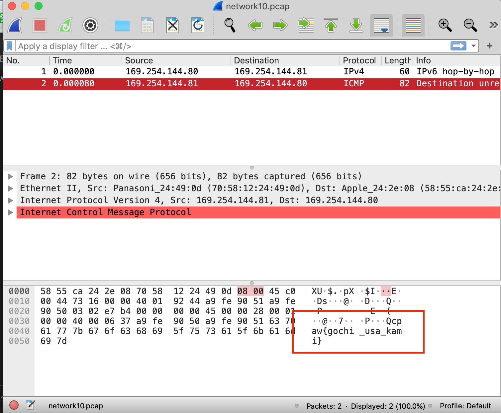

## 問題文
Q11.[Network]pcap

ネットワークを流れているデータはパケットというデータの塊です。
それを保存したのがpcapファイルです。
pcapファイルを開いて、ネットワークにふれてみましょう！

pcapファイル

## 解答
pcapファイルを開くにはいくつか方法があるが、Wirespark(アプリ)を使用して解析するのか最も簡便な方法

Wiresparkをインストール後network10.pcapを開き、flagを確認した

## 参考
Wiresharkダウンロード使い方：https://www.file-extension.info/ja/format/pcap

